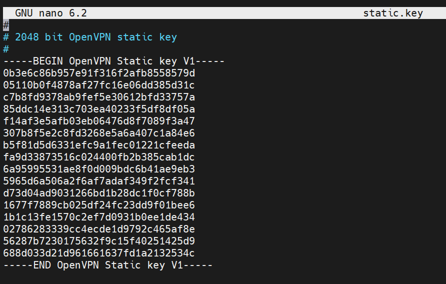

# # homework-VPN

Описание домашнего задания
---
1. Настроить VPN между двумя ВМ в tun/tap режимах, замерить скорость в туннелях, сделать вывод об отличающихся показателях


2. Поднять RAS на базе OpenVPN с клиентскими сертификатами, подключиться с локальной машины на ВМ


---
ОС для настройки: ubuntu 22_04 (7 виртуальных машин)

Vagrant версии 2.4.1

VirtualBox версии 7.0.18


---
- Этап 1: TUN/TAP режимы VPN


**Поднимаем ВМ из Vagrantfive** версии 1


**Устанавливаем нужные пакеты и отключаем SELinux** И на сервер, и на клиента

```bash
apt update
apt install openvpn iperf3 selinux-utils
setenforce 0
```

**Cоздаем файл-ключ** На Server


openvpn --genkey secret /etc/openvpn/static.key


**Cоздаем конфигурационный файл OpenVPN**

```bash
nano /etc/openvpn/server.conf

dev tap 
ifconfig 10.10.10.1 255.255.255.0 
topology subnet 
secret /etc/openvpn/static.key 
comp-lzo 
status /var/log/openvpn-status.log 
log /var/log/openvpn.log  
verb 3
```


**Создаем service unit для запуска OpenVPN**

```bash
nano /etc/systemd/system/openvpn@.service

[Unit] 
Description=OpenVPN Tunneling Application On %I 
After=network.target 
[Service] 
Type=notify 
PrivateTmp=true 
ExecStart=/usr/sbin/openvpn --cd /etc/openvpn/ --config %i.conf 
[Install] 
WantedBy=multi-user.target
```


**Запускаем сервис**

```bash
systemctl start openvpn@server 
systemctl enable openvpn@server
```

---
**Переходим на Client**


**Cоздаем конфигурационный файл OpenVPN**


```bash
nano /etc/openvpn/server.conf

dev tap 
remote 192.168.56.10 
ifconfig 10.10.10.2 255.255.255.0 
topology subnet 
route 192.168.56.0 255.255.255.0 
secret /etc/openvpn/static.key
comp-lzo
status /var/log/openvpn-status.log 
log /var/log/openvpn.log 
verb 3
```


**В директорию /etc/openvpn необходимо скопировать файл-ключ static.key, который был создан на Server**


**Примечание:** *Не обязательно копировать сам файл, можно создать одноименный и скопировать содержимое*





**Создаем service unit для запуска OpenVPN**

```bash
nano /etc/systemd/system/openvpn@.service

[Unit] 
Description=OpenVPN Tunneling Application On %I 
After=network.target 
[Service] 
Type=notify 
PrivateTmp=true 
ExecStart=/usr/sbin/openvpn --cd /etc/openvpn/ --config %i.conf 
[Install] 
WantedBy=multi-user.target
```


**Запускаем сервис**

```bash
systemctl start openvpn@server 
systemctl enable openvpn@server
```


**Далее необходимо замерить скорость в туннеле**


**На Server запускаем iperf3 в режиме сервера: iperf3 -s &**


**На Client запускаем iperf3 в режиме клиента и замеряем  скорость в туннеле: iperf3 -c 10.10.10.1 -t 40 -i 5**


**Повторяем замер скорости для режима работы tun. Конфигурационные файлы сервера и клиента изменятся только в директиве dev**


**На скрине сравнение режима, сначала tun, потом tap**


**Анализируя результат, можно сделать вывод, что пропускная способность в режиме tap немного больше**  


---
- Этап 3: RAS на базе OpenVPN 


*На виртуалке под Ubuntu внутри еще 2 виртуалки не поднимаются и всё вечно падает, а раз для второго задания требуется всего одна VM и хост, переходит туда (зря что ли у меня виртуалка для ДЗ есть)))*


**Для выполнения данного задания можно воспользоваться Vagrantfile из 1 задания, только убрать одну ВМ. После запуска отключаем SELinux (setenforce 0) или создаём правило для него.**


**В файлах репозитория это будет Vagrantfile версии 2**


**Устанавливаем необходимые пакеты**

```bash
apt update
apt install openvpn selinux-utils easy-rsa
#отключаем SELinux
setenforce 0
```


**Переходим в директорию /etc/openvpn и инициализируем PKI**


```bash
cd /etc/openvpn
/usr/share/easy-rsa/easyrsa init-pki
```


**Генерируем необходимые ключи и сертификаты для сервера**


```bash
echo 'rasvpn' | /usr/share/easy-rsa/easyrsa gen-req server nopass
echo 'rasvpn' | /usr/share/easy-rsa/easyrsa build-ca nopass # В методичке нет, но он нужен
echo 'yes' | /usr/share/easy-rsa/easyrsa sign-req server server 
/usr/share/easy-rsa/easyrsa gen-dh
openvpn --genkey secret ca.key

# Еще заметочка, нужно запускаться из правильной директории
```


**Ну реально минут 10 ждал :D**


**Генерируем необходимые ключи и сертификаты для клиента**


```bash
echo 'client' | /usr/share/easy-rsa/easyrsa gen-req client nopass
echo 'yes' | /usr/share/easy-rsa/easyrsa sign-req client client
```


**Создаем конфигурационный файл сервера**


```bash
nano /etc/openvpn/server.conf

port 1207 
proto udp 
dev tun 
ca /etc/openvpn/pki/ca.crt 
cert /etc/openvpn/pki/issued/server.crt 
key /etc/openvpn/pki/private/server.key 
dh /etc/openvpn/pki/dh.pem 
server 10.10.10.0 255.255.255.0 
ifconfig-pool-persist ipp.txt 
client-to-client 
client-config-dir /etc/openvpn/client 
keepalive 10 120 
comp-lzo 
persist-key 
persist-tun 
status /var/log/openvpn-status.log 
log /var/log/openvpn.log 
verb 3
```


**Зададим параметр iroute для клиента**


```bash
echo 'iroute 10.10.10.0 255.255.255.0' > /etc/openvpn/client/client
```


**Запускаем сервис (при необходимости создать файл юнита как в задании 1 - PS не понадобился юнит)**


```bash
systemctl start openvpn@server
systemctl enable openvpn@server
```


**Переходим на хост-машину**


**Необходимо создать файл client.conf**


```bash
nano /etc/openvpn/client.conf

dev tun 
proto udp 
remote 192.168.56.10 1207 
client 
resolv-retry infinite 
remote-cert-tls server 
ca ./ca.crt 
cert ./client.crt 
key ./client.key 
route 192.168.56.0 255.255.255.0 
persist-key 
persist-tun 
comp-lzo 
verb 3 
```


**Скопировать в одну директорию с client.conf файлы с сервера. В моем случае это /etc/openvpn/ на хост-машине**


**Примечание:** *Не обязательно прям копировать файл. достаточно скопировать содержимое в одноименные файлы*


**Далее можно проверить подключение с помощью: openvpn --config client.conf**


**При успешном подключении проверяем пинг по внутреннему IP адресу  сервера в туннеле: ping -c 4 10.10.10.1**


```bash
openvpn --config client.conf
```


**Также проверяем командой ip r (netstat -rn) на хостовой машине что сеть туннеля импортирована в таблицу маршрутизации.**


```bash
ip r
```


